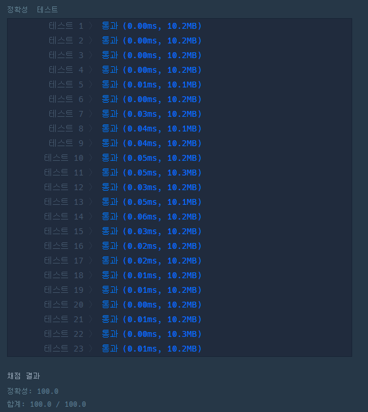

# 문제 :book:

## x만큼 간격이 있는 n개의 숫자

### 접근 방식

- `그리드` 알고리즘 기법으로 풀이
- 최대의 부서를 얻기 위해서는 __가장 작은 금액 신청 부서__ 부터 지원해야한다. 그러므로 `sort()`를 활용하여 **오름차순** 정렬
- 그리고 예산의 한도 범위 안에서만 `while`이 돌아가고 빠져나왔을 경우 `d`는 최대 지원 가능한 부서들의 리스트가 남는다.

<hr>

```python
def solution(d, budget):
    d.sort()
    while sum(d) > budget:
        d.pop()
    return len(d)
```

<hr>

## 실행 결과

