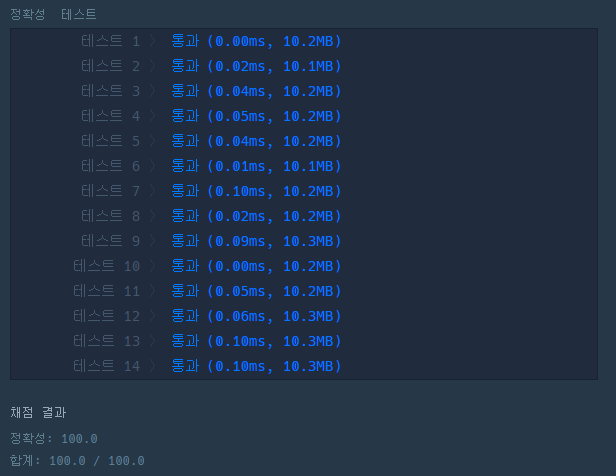

# 문제 book

## [연습문제] x만큼 간격이 있는 n개의 숫자

### 접근 방식

- 등차수열을 list로 표현한 것이므로 for문 또는 list comprehension을 활용

<hr>

```python
def solution(x, n):
    return [x * i for i in range(1, n + 1)] # list comprehension을 활용한 한줄 코딩
```

<hr>

## 샐행 결과

