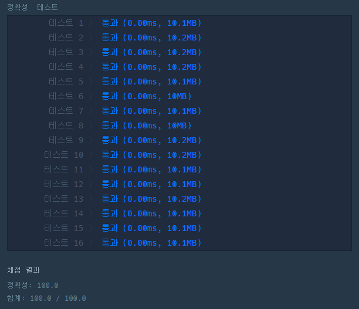

# 문제 :book:

## 가운데 글자 가져오기

### 접근 방식

- **짝수** 또는 **홀수** 일 경우에 따른 가지치기가 이루어진다.
  - 짝수 % 2 == 0 , 홀수 % 2 == 0 에 따라 __리스트 슬라이싱__ 이 달라진다.

<hr>

```python
# list comprehension 활용
def solution(s):
    length = len(s)
    if length % 2 == 1:
        return s[length // 2]
    return s[length // 2 - 1: length // 2 + 1]
```

<hr>

# 실행 결과

