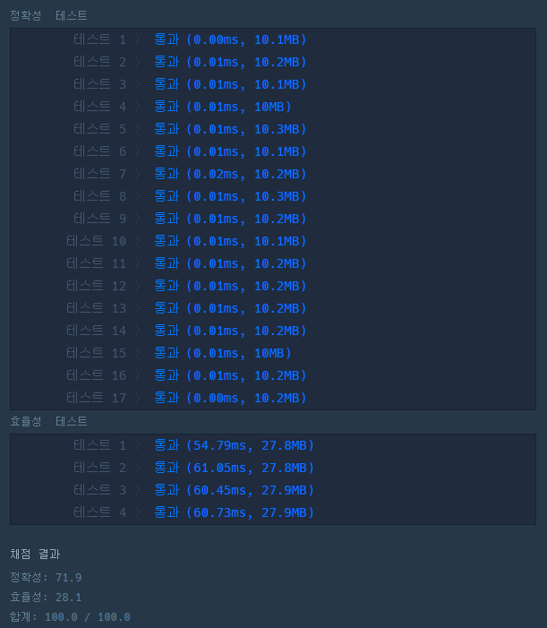

# 문제 :book:

## 같은 숫자는 싫어

### 접근 방식

- 자료구조 중 `stack, queue` 를 활용하여 풀 수 있는 문제
- `try-except` 문법을 활용한 __배열이 비어있을 경우__ 에 대한 예외 처리

<hr>

```python
# stack 을 활용하여 풀이

def solution(arr):
    stack = []
    
    for i in arr:
        try:
            if stack[-1] != i:
                stack.append(i)
        except:
            stack.append(i)
    return stack
```

<hr>

# 실행 결과

