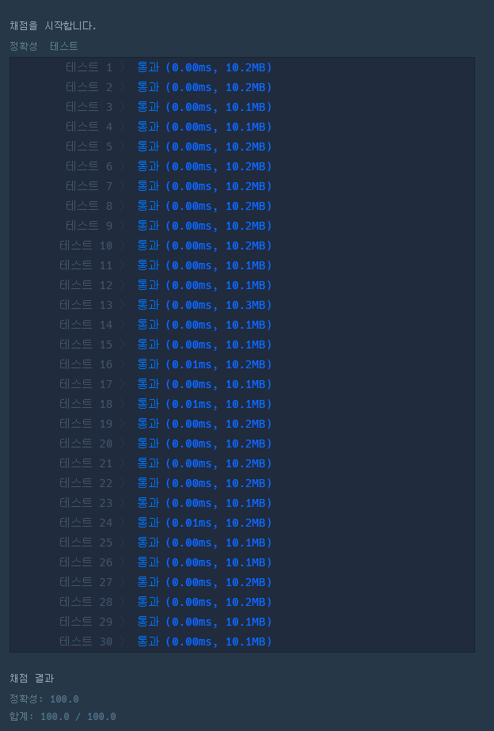

# 문제 :book:

## 문자열 내 p와 y의 개수

### 접근 방식

- **string.lower()** 는 알파벳을 소문자로 변환해준다.
- **string.upper()** 는 알파벳을 대문자로 변환해준다.
- **string.count(element)** 는 element 요소의 개수를 반환해준다.

<hr>

```python
def solution(s):
    s = s.lower()
    return s.count('y') == s.count('p')
```

<hr>

# 실행 결과

