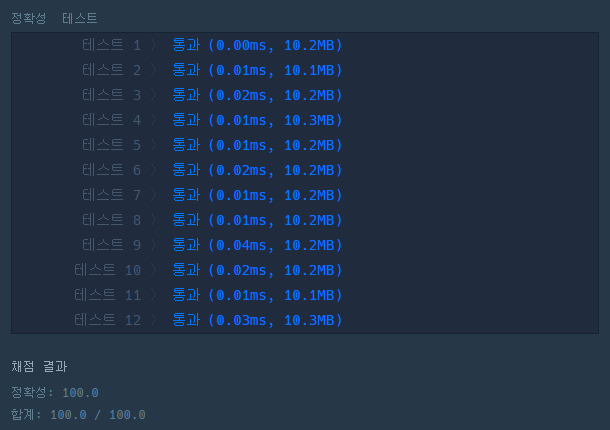

# 한줄 코딩

- sorted() 와 lambda를 병합하여 사용하면 한 줄 코딩이 가능하다.
- lambda 는 간단한 함수를 def function()으로 하지 않고, 일시적으로 사용할 때 사용된다.

<hr>

```python
def solution(strings, n):
    return sorted(strings, key=lambda x: (x[n], x))
```

<hr>

# 실행 결과

