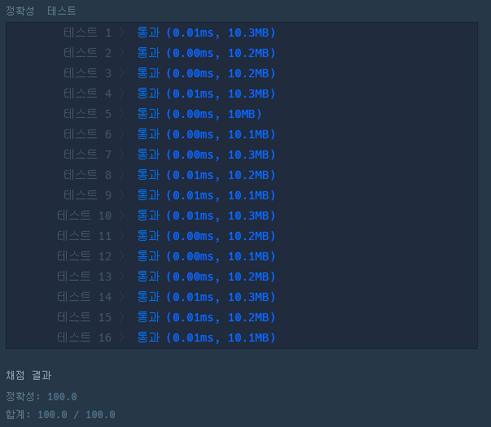

# 한줄 코딩으로 풀기

- string.isdigit()는 문자열에 숫자타입의 문자가 있으면 True를 보내준다.
  - isalpha()와 같은 다양한 모듈이 존재하니 알아두면 좋다.

<hr>

```python
def solution(s):
    return (len(s) == 4 or len(s) == 6) and s.isdigit()
```

<hr>

#실행 결과

