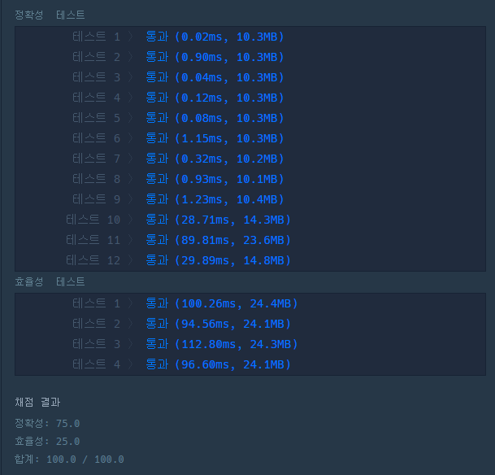

# 문제 :book:

## 소수 찾기

### 접근 방식

- 제한 조건이 큰 문제에서 소수를 찾는 문제는 **<a href="https://ko.wikipedia.org/wiki/%EC%97%90%EB%9D%BC%ED%86%A0%EC%8A%A4%ED%85%8C%EB%84%A4%EC%8A%A4%EC%9D%98_%EC%B2%B4">에라토스테네스의 체</a>**를 사용해야 한다.
- 이러한 방식의 시간 복잡도는 **N log (log N)** 으로 매우 효울적이다.

<hr>

```python
# n의 조건이 1000000이므로 일반적인 소수 찾기로는 효율성 문제가 있음
# 에라토스테네스의 체 활용

def solution(n):
    Prime = [True] * (n + 1)
    for i in range(2, int(n ** 0.5) + 1):
        if Prime[i]:
            for j in range(i * i, len(Prime), i):
                Prime[j] = False

    return  Prime[2:].count(True)   # 소수의 시작은 2부터 시작
```

<hr>

# 실행 결과

