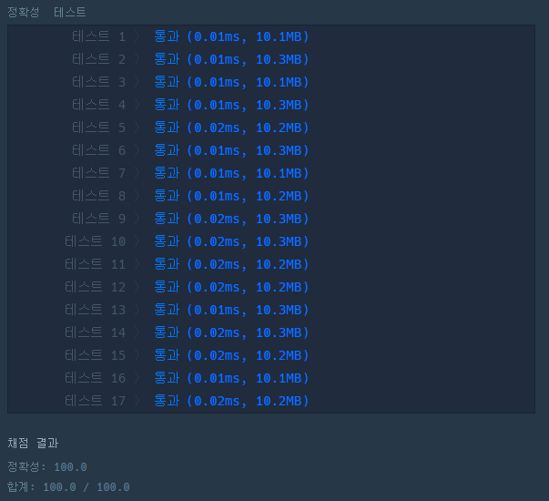

# 문제 :book:

## 약수의 합

### 접근 방식

- set()을 활용하면 정수 제곱근에 대해서 **가지치기** 를 할 필요가 없다.
    - 참고로 set()의 요소를 넣는 것은 add(element)이며 중복값에 대해서는 동작하지 않는 장점이 있다.

<hr>

```python
def solution(n):
    answer = set()  # 정수 제곱근일 경우 중복값을 제거하기 위함.
    for i in range(1, int(n ** 0.5) + 1):   # 제곱근으로 판별 시, 더 효율적이다.
        if n % i == 0:
            answer.add(i)
            answer.add((n // i))

    return sum(answer)
```

<hr>

# 실행 결과

