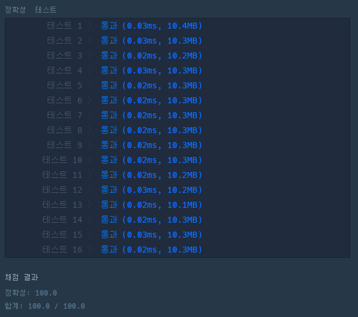

# 문제 :book:

## 정수 내림차순으로 배치하기

### 접근 방식

- 함수로 받아올 때, 정수로 받아오기때문에 문자열 리스트 형식으로 변환해준다.
- **''.join()** 과 **list comprehension** 을 활용하면 한줄 코딩이 가능하다.

<hr>

```python
def solution(n):
    return int(''.join(sorted([i for i in str(n)], reverse=True)))
```

<hr>

## 실행 결과

