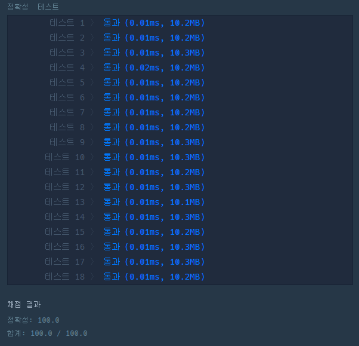

# 문제 :book:

## 정수 제곱근 판별

### 접근 방식

- __**__ 연산자는 제곱을 뜻하며 **n ** 0.5** 는 제곱근을 의미하게 된다.
- type()의 형식으로 비교하면 정수 제곱근인지 확인이 가능하다.
  - 예를 들어) (8 ** 0.5 = 2.82) != (int(8 ** 0.2) == 2) 로 **False** 
  
<hr>

```python
def solution(n):
    return int(((n ** 0.5) + 1) ** 2) if int(n ** 0.5) == n ** 0.5 else -1
```

<hr>

## 실행 결과

