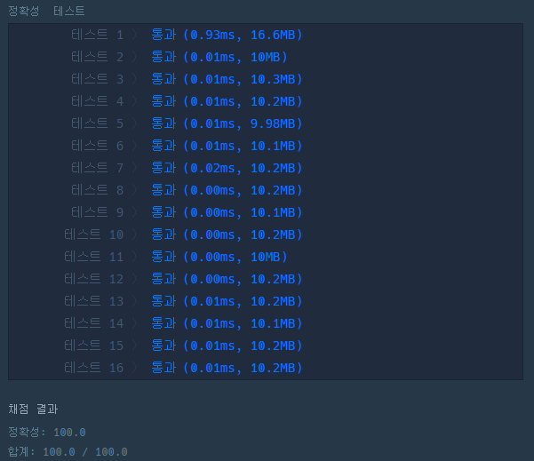

# 문제 :book:

## 제일 작은 수 제거하기

### 접근 방식

- **list.remove()** 를 활용하여 특정 값을 제거할 수 있다.
- **min(list)** 를 활용하여 리스트의 최소 값을 구할 수 있다.

<hr>

```python
def solution(arr):
    if len(arr) > 1:            # 길이가 2 이상부터 적용된다.
        arr.remove(min(arr))    # list.remove()를 적용하여 해당 값을 삭제한다.
        return arr
    else:
        return [-1]
```

<hr>

## 실행 결과

