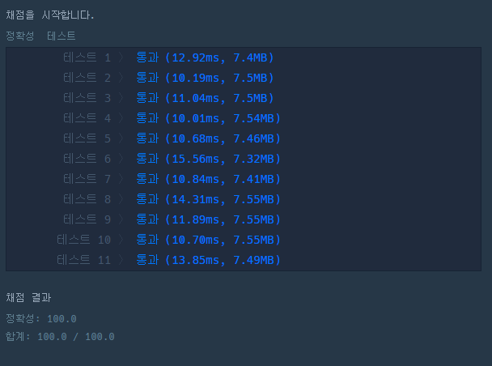

# 문제 :book:

## [연습문제] 직사각형 별찍기

### 접근 방식

- map() 메소드를 활용하여 두 개의 입력값을 받은 후 for()으로 * 찍기

<hr>

```python
a, b = map(int, input().split())

# 이중 for문 구현할 필요 없이 문자열에 *을 하여 늘릴 수 있다.
for i in range(b):
    print('*' * a)
```

<hr>

## 실행 결과

