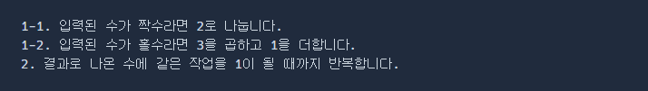
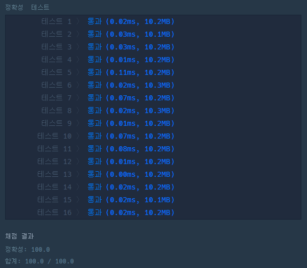

# 문제 :book:

## 콜라츠 추측

### 접근 방식

- 조건에 따른 if문 분기 처리
  

<hr>

```python
def solution(n):
    # n == 1 일 경우, 0을 반환
    if n == 1:
        return 0

    cnt = 1
    while cnt < 501 and n != 1:
        # 문제의 조건에 대한 if ~ else
        n = n // 2 if n % 2 == 0 else n * 3 + 1
        if n == 1:
            return cnt
        cnt += 1
    return -1
```

<hr>

## 실행 결과

