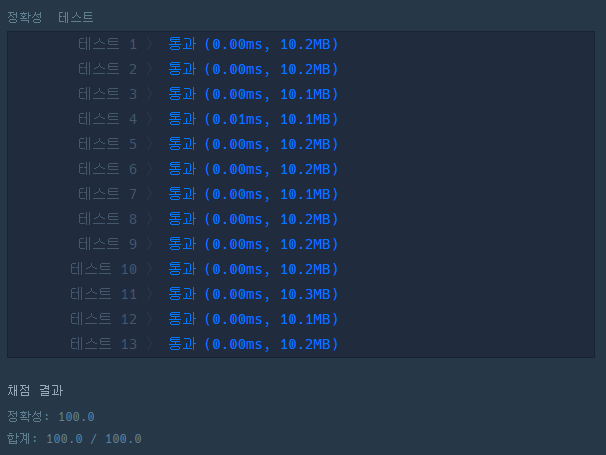

# 문제 :book:

##

### 접근 방식

**문제의 조건**

- __맨 뒷번호 4자리__ 는 항상 존재하기 때문에 list slicing 을 활용하여 간단하게 구현 가능하다.

<hr>

```python
def solution(phone_number):
    return ('*' * (len(phone_number) - 4 )) + phone_number[-4::]    # [-4::] 라는 것은 맨 뒤에서 4번째부터 마지막까지라는 의미
```

<hr>

## 실행 결과

