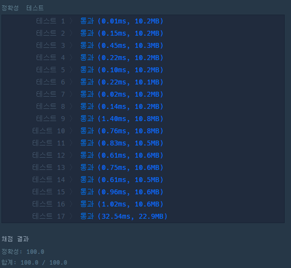

# 문제 book

## 행렬의 덧셈

### 접근 방식

- 이중 for문을 활용하여 각 리스트의 index에 대해 덧셈 결과를 저장한다.

<hr>

```python
def solution(arr1, arr2):
    answer = []
    for i in range(len(arr1)):
        temp = []
        for j in range(len(arr1[i])):
            temp.append(arr1[i][j] + arr2[i][j])
        answer.append(temp)
    return answer
```

<hr>

## 실행 결과

