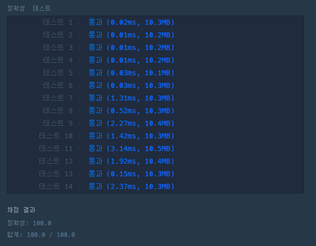

# 문제 :book:

## 모의고사

### 접근 방식

- 각 반복 횟수와 나머지를 구하고 `list slice` 를 통한 구현

<hr>

```python
# 완전 탐색
def solution(answers):
    # 학생들의 규칙적인 답안을 리스트로 정리 및 필요한 길이만큼 연장
    student_1 = [1, 2, 3, 4, 5]
    student_2 = [2, 1, 2, 3, 2, 4, 2, 5]
    student_3 = [3, 3, 1, 1, 2, 2, 4, 4, 5, 5]

    student_1 = student_1 * (len(answers) // len(student_1)) + student_1[:len(answers) % len(student_1)]
    student_2 = student_2 * (len(answers) // len(student_2)) + student_2[:len(answers) % len(student_2)]
    student_3 = student_3 * (len(answers) // len(student_3)) + student_3[:len(answers) % len(student_3)]

    # 3명이 맞은 갯수를 저장한다.
    rank = [0] * 3
    for i, v in enumerate(answers):
        if student_1[i] == v:
            rank[0] += 1
        if student_2[i] == v:
            rank[1] += 1
        if student_3[i] == v:
            rank[2] += 1
        
    return [i + 1 for i in range(3) if rank[i] == max(rank)]
```

<hr>

## 실행 결과

