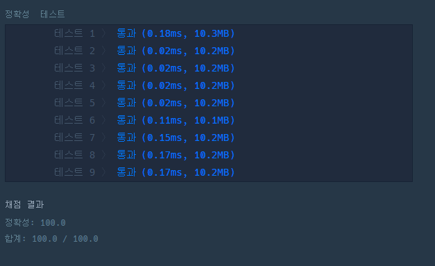

# 문제 :book:

## 내적

### 접근 방식

- `list comprehension`을 활용한 Pythonic한 코딩

<hr>

```python
# list comprehension을 사용한 pythonic한 코딩
def solution(a, b):
    return sum([a[i] * b[i] for i in range(len(a))])
```

<hr>

## 실행 결과

