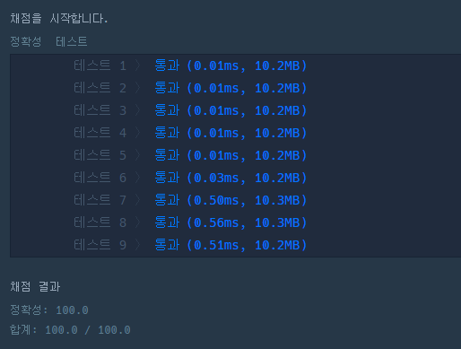

# 문제 :book:

## 두 개 뽑아서 더하기

### 접근 방식

- 서로 다른 2개의 수 --> **조합** 을 활용한 풀이
- 내장 라이브러리 `itertools`의 `combinations`를 활용하여 조합 함수를 구현 할 수 있다.
    ```python
        from itertools import combinations
        
        a = list(combinations(list, n)) # 이러한 구조를 가진다.
    ```
  
<hr>

```python
from itertools import combinations


def solution(numbers):
    return sorted(list(set([sum(i) for i in combinations(numbers, 2)])))
```

<hr>

## 실행 결과

