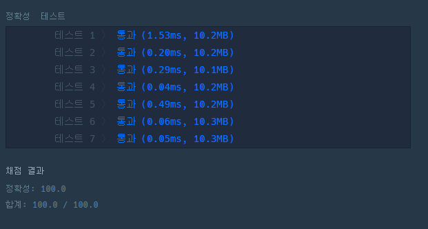

# 문제 :book:

## 약수의 개수와 덧셈

### 접근 방식

- left 와 right를 기준으로 `for` 문을 수행
- 만약 **완전 제곱수면** 약수의 갯수가 홀수, 그렇지 않으면 짝수라는 점을 활용한다. 

<hr>

```python
# 약수의 개수가 짝수면 더하고, 홀수면 뺀다.
# sqrt() 또는 a ** b를 이용
def solution(left, right):
    answer = 0
    for number in range(left, right + 1):

        # 약수의 개수가 홀수인것은 제곱근이 정수만 성립된다.
        if number ** 0.5 != int(number ** 0.5):
            answer += number
        else:
            answer -= number
    return answer
```

<hr>

## 실행 결과

