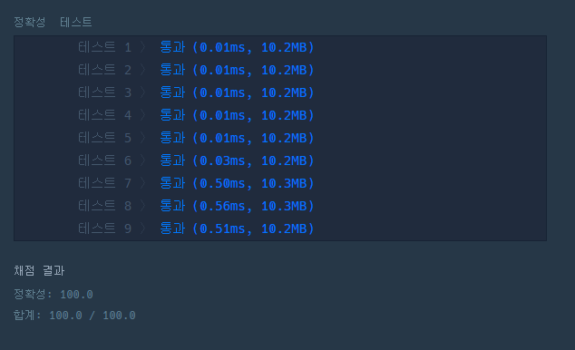

# 문제 :book:

## 두 개 뽑아서 더하기

### 접근 방식

`from itertools import combinations`를 활용하여 **조합**을 뽑아내며, 중복되는 수는 `set`을 사용하여 제거한다.

<hr>

```python
from itertools import combinations

# list comprehension을 활용하여 한줄 코딩
def solution(numbers):
    return sorted(list(set([sum(i) for i in combinations(numbers, 2)])))

```

<hr>

## 실행 결과

