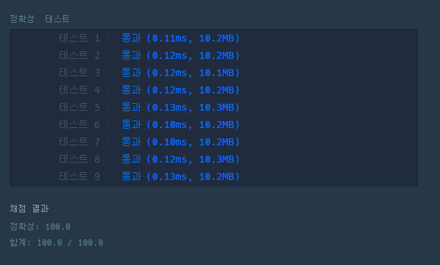

# 문제 :book:

## 음양 더하기

### 접근 방식

`enumerate` 를 활용하여 `index`와 `value` 값을 모두 뽑아낸다.

그 후 해당 `value`의 bool 값을 비교하여 음수 또는 양수의 분기를 설정한다.

<hr>

```python
def solution(absolutes, signs):
    for i, v in enumerate(signs):
        if not v:
            absolutes[i] = -absolutes[i]
    return sum(absolutes)
```

<hr>

## 실행 결과

