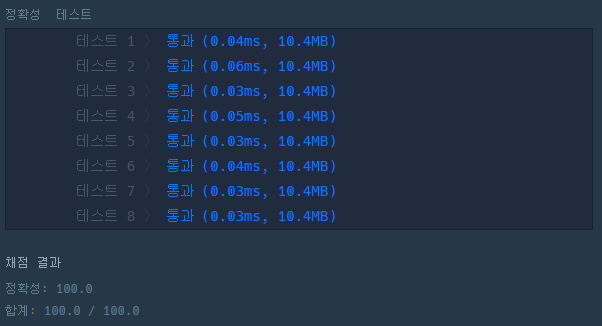

# 문제 :book:

## 비밀지도

### 접근 방식

- `format()`을 활용하여 10진법 정수를 2진법의 문자열로 치환한다.
- 문자열로 치환한 값을 정수로 변환하고 합을 구한 후 다시 문자열로 치환한다.
- 주어진 n의 따라 문자열의 갯수를 맞추어 주기위해 '0'을 왼쪽에서 삽입한다.

<hr>

```python
def solution(n, arr1, arr2):
    arr1 = [int(format(i , 'b')) for i in arr1]
    arr2 = [int(format(i, 'b')) for i in arr2]
    
    maps = []
    for i in range(n):
        temp = ''
        number = '0' * (n - len(str(arr1[i] + arr2[i]))) + str(arr1[i] + arr2[i])
        
        for _number in number:
            if _number != '0':
                temp += '#'
            else:
                temp += ' '
        maps.append(temp)
    return maps
```

<hr>

# 실행 결과

