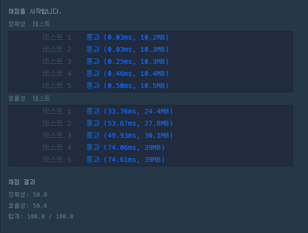

# 문제 :book:

## 완주하지 못한 선수

### 접근 방식

1. `Counter` 을 활용하여 __딕셔너리__ 데이터 타입으로 변경한다.

2. 이 때, `Counter` 로 변경된 데이터는 사칙연산 중 **+, -** 가 동작한다. 단) / 또는 * 는 가능하지 않는다는 점

3. 문제에서 __완주하지 못하는 선수는 단 1명__ 이므로 `most_common()` 을 활용하여 `list`형식으로 타입을 변환한 후 해당 되는 선수의 이름을 불러온다.

<hr>

```python
from collections import Counter

# Counter 를 활용하여 문제 풀이
def solution(participant, completion):
    participant, completion = Counter(participant), Counter(completion)
    return (participant - completion).most_common()[0][0]


```

<hr>

## 실행 결과

