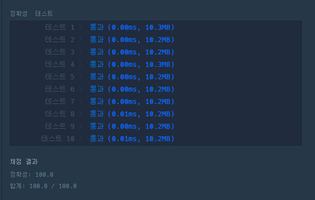

# 문제 :book:

## N개의 최소공배수

### 접근 방식

- python은 math 라이브러리에서 `최대공약수`를 구하는 모듈이 존재한다.
    `from math import gcd`로 사용
- 최소공배수의 공식은 `LCD = (a*b) // GCD`

<hr>

```python
from math import gcd

def solution(array):
    result = 1
    for i in array:
        GCD = gcd(result, i)
        result *= i // GCD
    return result
```

<hr>

## 실행 결과

