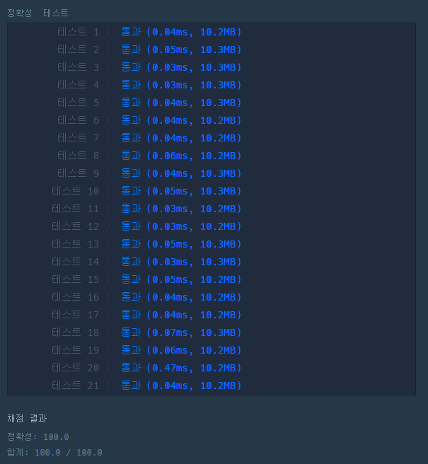

# 문제 :book:

## 1주차 - 부족한 금액 계산하기

### 접근 방식

**문제의 조건**
- __자기평가를 한 점수가 받은 평가 점수 중 가장 높거나 가장 낮을 경우 제외를 하고 평균을 계산한다.__

```python
if Counter(score)[self_score] == 1 and (self_score == min(score) or self_score == max(score)):
    result = int((sum(score) - self_score) / (length - 1))  # 자기 자신을 평가한 점수와 인원 수를 제외하고 평균 계산
else:
    result = int(sum(score) / length)
```

**zip()을 활용한 행-열 교환**

```python
for i, score in enumerate(list(zip(*scores))):
```

<hr>


```python
# 리스트의 요소 중 중복된 요소를 포함하여 개수를 세어주는 라이브러리
from collections import Counter

def solution(scores):
    length, answer = len(scores), ''

    # zip함수를 활용하여 행-열 순서를 열-행 순서로 리스트 교환
    for i, score in enumerate(list(zip(*scores))):
        self_score = score[i]

        # 스스로를 평가한 점수이며 평가점수 중 가장 낮거나 가장 높은 수일 경우
        if Counter(score)[self_score] == 1 and (self_score == min(score) or self_score == max(score)):
            result = int((sum(score) - self_score) / (length - 1))
        else:
            result = int(sum(score) / length)

        # 점수에 따른 학점
        if result >= 90:
            answer += 'A'
        elif result >= 80:
            answer += 'B'
        elif result >= 70:
            answer += 'C'
        elif result >= 50:
            answer += 'D'
        else:
            answer += 'F'

        return answer
```
-----
## 실행 결과

